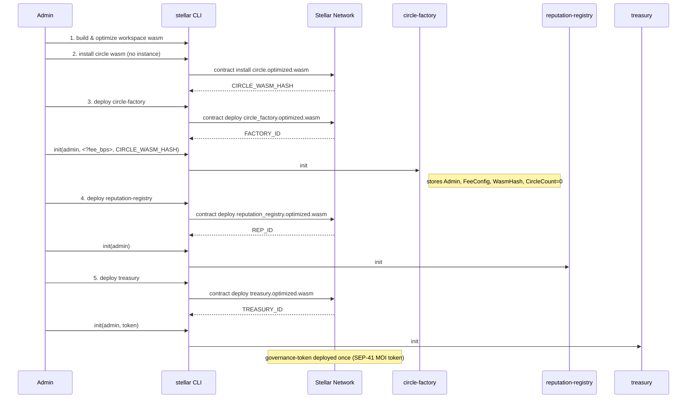
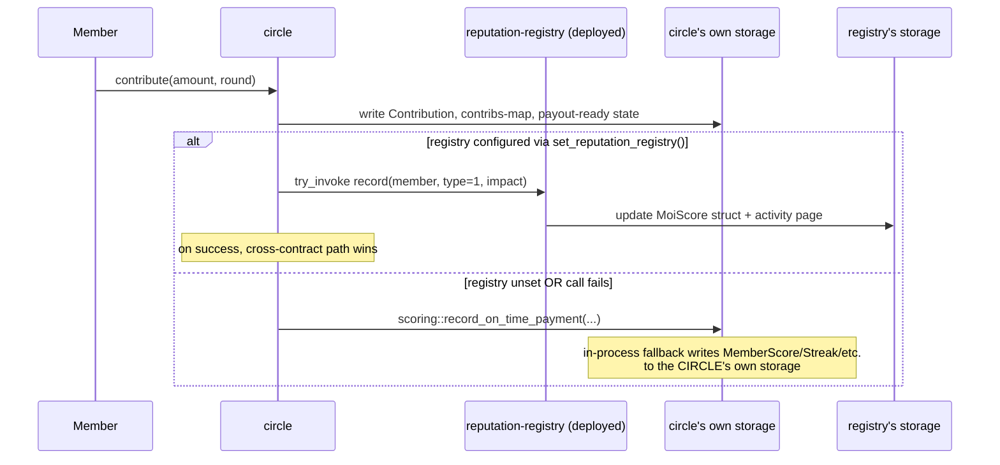
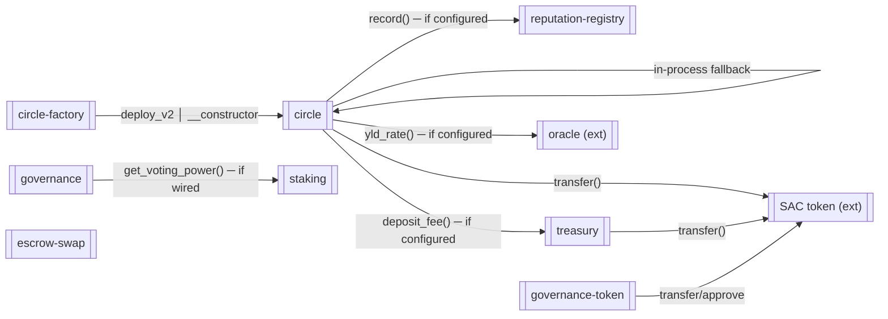

# Moistello Contracts — System Architecture

This document gives new contributors a high-level, system-wide view of the
Moistello smart-contract ecosystem: how the five core contracts interact,
which events they emit, how data flows between them, how storage is laid out
per contract, and how upgrades move the system forward safely.

It complements the per-contract docs in [`README.md`](../README.md) (business
overview) and [`UPGRADE.md`](./UPGRADE.md) (detailed upgrade/migration
procedure). Where the three disagree, treat the source code under
[`packages/`](../packages) as authoritative, then open an issue.

---

## 1. Contract inventory

The protocol is built from **five deployable contracts** plus the shared
`common` library (linked in-process, never deployed on its own).

| Contract | Package | Purpose | Role in the system |
|---|---|---|---|
| `circle-factory` | [`packages/circle-factory`](../packages/circle-factory) | Deploys new Circle instances, keeps a registry of every circle it created | **Creator / registrar** |
| `circle` | [`packages/circle`](../packages/circle) | Core ROSCA engine — join, contribute, 4 payout types, penalties, disputes | **Per-circle escrow + rules** |
| `reputation-registry` | [`packages/reputation-registry`](../packages/reputation-registry) | On-chain MoiScore (0–1000) and activity history | **Trust ledger** |
| `governance-token` | [`packages/governance-token`](../packages/governance-token) | SEP-41 MOI token (transfer/mint/burn/freeze/clawback) | **DAO token** |
| `treasury` | [`packages/treasury`](../packages/treasury) | Collects the protocol fee | **Fee sink** |
| `common` | [`packages/common`](../packages/common) | Shared VRF, math, access control, pause, upgrade, reentrancy guards | **Toolkit (not deployed)** |

Newer packages that extend the ecosystem (not part of the original five): see
[§8 Extended packages](#8-extended-packages).

> The original "5 contracts" deployment (testnet v1, commit `c6d4187`)
> covered exactly `circle-factory`, `circle`, `reputation-registry`,
> `governance-token`, and `treasury`.

---

## 2. System map

```mermaid
flowchart TB
    subgraph Users
        U[Organizer / Members / Admins]
    end

    subgraph External
        SAC[(Soroban Asset Contract<br/>USDC / XLM)]
        ORACLE[Yield Oracle<br/>(optional, primary + fallback)]
    end

    subgraph Core["Moistello Protocol (Soroban)"]
        FACTORY[[circle-factory]]
        CIRCLE[[circle]]
        REPO[[reputation-registry]]
        TOKEN[[governance-token]]
        TREAS[[treasury]]
    end

    U -- "deploy_circle(config)" --> FACTORY
    FACTORY -- "deploy_v2(wasm_hash, args)" --> CIRCLE

    U -- "join / contribute" --> CIRCLE
    CIRCLE -- "transfer (collateral, contribution, payout)" --> SAC
    CIRCLE -- "record(types 1/2/4) + in-process scoring" --> REPO
    CIRCLE -- "deposit_fee() + authorized transfer" --> TREAS
    CIRCLE -- "yld_rate(round)" --> ORACLE

    U -- "stake / unstake / governance" --> EXT["staking, governance, escrow-swap, governance-token*"]

    TREAS -- "transfer" --> SAC
    TOKEN --- SAC
```

`*` See §8 — staking/governance/escrow-swap extend the five-contract core.

---

## 3. Deployment order

Deployment is manifest-driven (`scripts/deploy-manifest.json`) and executed by
`scripts/deploy-upgrade.sh` (or the plainer `scripts/deploy.sh`). Order
matters: the factory cannot be initialized until the Circle WASM is installed,
because it must store the Circle WASM hash and use it to deploy circles.

### 3.1 Order (current manifest)



> The manifest currently lists **circle (install-only) → circle-factory →
> reputation-registry → treasury**. `scripts/deploy.sh` performs the same set
> in a slightly different order (factory → circle install → reputation →
> treasury); both are valid as long as the Circle WASM is installed before the
> factory `init`.

### 3.2 Dependencies between contracts

| Contract | Deployed before | Requires at deploy time | Wired later (admin) |
|---|---|---|---|
| circle-factory | circle WASM install | `circle_wasm_hash`, admin | — |
| circle | factory | (deployed per-circle by factory) | token, treasury, reputation-registry, oracle |
| reputation-registry | nothing | admin | — |
| governance-token | nothing | admin, name, symbol, decimals | — |
| treasury | nothing | admin, token | — |

Per-circle contract IDs are **not** known at deploy time — they are produced
by `circle-factory.deploy_circle(config)` at runtime and recorded in the
factory's registry (§5).

---

## 4. Cross-contract call flow

There are four interfaces between contracts, plus the shape of the deferred
(admin-wired) dependencies. Callers always authenticate first; every mutating
entry point runs `require_auth()` and (where applicable) the shared
reentrancy guard before touching storage.

### 4.1 Factory → Circle (deploy)

`circle-factory.deploy_circle(config)`:

1. Validates config (max_members ≥ 2, contribution > 0, rounds > 0,
   payout_type ≤ 3, non-empty unique slug).
2. Reads the stored Circle WASM hash + increments `CircleCount` to build a
   creation `salt`.
3. `env.deployer().with_current_contract(salt).deploy_v2(wasm, args)` where
   `args = (organizer, factory_address, config)`.
4. The **new Circle's `__constructor`** runs `contract::init`: it persists the
   `Circle` state, stores `Admin = organizer` and `Factory = factory`, and
   initializes empty persistent collections + VRF seed.
5. The factory records the new circle in its persistent registry
   (`CircleList`, `CircleConfig(cid)`, `Slug(slug)`) and emits `deploy`.

Token flows at this point: **none** (membership/collateral happens at `join`).

### 4.2 Circle → Reputation-registry (dual-path scoring)

The Circle **links the `reputation_registry` crate as an in-process library**
and, when configured, also calls the **deployed registry cross-contract**.
This dual path affects how scores land in storage:



Where each reputation read/write happens today:

| Circle entry point | Read (in-process) | Write path |
|---|---|---|
| `__constructor`/`init` | `scoring::max_circle_size`, `scoring::max_contribution` | none |
| `join` | `scoring::get_score` (against `MemberScore`) | none (score is read-only gate) |
| `batch_invite` | `scoring::get_score` | none |
| `contribute` | — | cross-contract `record(member,1,1)` → fallback `scoring::record_on_time_payment` |
| `trigger_payout` (done) | — | cross-contract `record(recipient,4,1)` and `record(member,2,5)` per active member → fallback `scoring::record_circle_completion` |
| `report_late` (default) | — | `scoring::record_default` (in-process) |

> **Implication for contributors:** with no registry wired and no in-process
> score entries yet, tier gates (`min_moi_score`, `max_circle_size`,
> `max_contribution`) resolve to **Bronze defaults** (score 0, 5-member max,
> 100 USDC). Wire `reputation-registry` into a circle (admin
> `set_reputation_registry`) to gate against the canonical on-chain scores.

### 4.3 Circle → Treasury (protocol fee)

On every `trigger_payout`, the circle computes `fee = apply_fee(pool, fee_bps)`.
When a treasury is configured and `fee > 0`:

1. The circle authorizes a **SAC transfer** `circle → treasury` for the fee
   (via `authorize_as_current_contract` + `SubContractInvocation`).
2. It cross-contract calls `treasury.deposit_fee(from=circle, amount, circle_id=circle)`.
3. Treasury records the deposit and emits `deposit` (`FeeDeposited`).

`batch_payout` charges the configured fee too, but transfers the fee straight
to the treasury address via a plain token transfer (no `deposit_fee` call).
`deposit_fee` enforces `from == circle_id`, so only a circle can credit its own
fees.

### 4.4 Circle → Oracle (optional yield)

Before resolving a payout, `trigger_payout` calls `get_yield_rate(round)`:

1. No oracle configured → `Ok(0)` (round proceeds, zero yield).
2. Primary oracle `yld_rate(round)` succeeds → returns the rate.
3. Primary fails → fallback oracle is tried; on success the circle emits the
   `orc_fall` (`OracleFallbackUsed`) event for indexer visibility.
4. Both fail / no fallback → `Err(OracleUnavailable)`.

### 4.5 Governance → Staking (voting power)

`governance.get_vote_power(voter)` invokes `staking.get_voting_power(voter)`
(cross-contract, wired via admin `set_staking_contract`). Staking returns
token amount × period multiplier; governance uses it for proposal vote
weighting.

### 4.6 Token (SAC) transfers on the circle

The circle holds funds only transiently; it never retains surplus.

| Entry point | Token direction | Amount |
|---|---|---|
| `join` | member → circle | `collateral_amount` (if > 0) |
| `contribute` | member → circle | `contribution_amount` exactly |
| `trigger_payout` | circle → members / recipient | net share (+ dust to recipient) |
| `exit` | circle → member | collateral refund; 5% penalty withheld |
| `cancel_circle` | circle → members | collateral refund while PENDING |
| `resolve_dispute` (refund) | circle → members | total contributions refunded |
| `batch_payout` | circle → recipient + treasury | net + fee |

### 4.7 Cross-contract invocation table (summary)



---

## 5. Storage layout per contract

Soroban has three live storage regions. This codebase uses them deliberately:

- **instance** — small, hot configuration (admin, fee, token, current state).
- **persistent** — large/growing collections (members, contributions, history).
- **temporary** — the reentrancy flag (auto-expires if a tx panics).

### 5.1 common (shared)

| Key (symbol/type) | Region | Value | Managed by |
|---|---|---|---|
| `paused` | instance | `bool` | `common::pause` |
| `reent` | temporary | `bool` (TTL 2 ledgers) | `common::reentrancy::ReentrancyGuard` |
| `impl` | instance | `Address` (proxy implementation) | `common::upgrade::set_implementation` |

### 5.2 circle-factory

| DataKey | Region | Value | Notes |
|---|---|---|---|
| `Admin` | instance | `Address` | set in `init` |
| `FeeConfig` | instance | `FeeConfig { fee_bps, updated_at, updated_by }` | basis points, 0–10_000 |
| `WasmHash` | instance | `BytesN<32>` | Circle WASM hash used by `deploy_v2` |
| `CircleCount` | instance | `u32` | salt source for deterministic circle IDs |
| `CircleList` | persistent | `Vec<CircleEntry>` | registry of every deployed circle |
| `CircleConfig(cid)` | persistent | `CircleConfig` | per-circle config snapshot |
| `Slug(slug)` | persistent | `Address` | slug → circle ID uniqueness map |

Events: `deploy` (`CircleDeployed`), `fee_cfg` (`FeeConfigUpdated`).

### 5.3 circle (per-instance)

| DataKey | Region | Value | Notes |
|---|---|---|---|
| `Circle` | instance | `Circle` (all lean state) | status, round counter, payout bitmap, totals |
| `Admin` | instance | `Address` | deployer-set (organizer at deploy) |
| `Factory` | instance | `Address` | deploying factory |
| `FeeBps` | instance | `u32` | per-circle protocol fee |
| `Treasury` | instance | `Address` | optional; set by admin |
| `Token` | instance | `Address` | contribution/payout asset (SAC) |
| `ReputationRegistry` | instance | `Address` | optional; set by admin |
| `OracleContract` / `FallbackOracle` | instance | `Address` | optional yield oracles |
| `Members` | persistent | `Vec<Member>` | grows per join / batch_invite |
| `Contributions` | persistent | `Vec<Contribution>` | grows per round |
| `contribs` | persistent | `Map<(Address,u32), bool>` | O(1) already-contributed check (#387) |
| `Payouts` | persistent | `Vec<PayoutRecipient>` | payout + fee history |
| `Bids` | persistent | `Vec<AuctionBid>` | auction rounds |
| `Votes` | persistent | `Vec<VoteEntry>` | vote rounds |
| `Dispute` | persistent | `DisputeEntry` | single active dispute |
| `Referrals` | persistent | `Vec<Referral>` | referral registry |
| `Allowlist` | persistent | `Vec<Address>` | empty = open join |

`Circle` fields (state you'll read most): `status` (0 pending, 1 active,
2 completed, 3 cancelled, 4 disputed), `current_round`, `total_rounds`,
`payout_type` (0 random, 1 fixed, 2 auction, 3 vote), `payout_bitmap`
(bitfield of paid positions), `member_count`, `total_payouts`, `total_fees`.

Events: `joined`, `contrib`, `payout`, `complete`, `bid`, `vote`, `exited`,
`default`, `cancel`, `disputed`, `referral`, `orc_fall` (see §6).

### 5.4 reputation-registry

| DataKey | Region | Value | Notes |
|---|---|---|---|
| `Admin` | instance | `Address` | |
| `Score(user)` | persistent | `MoiScore` struct | canonical recorded score path |
| `UserActivityPage(user, page)` | persistent | `Vec<Activity>` | 50 entries/page |
| `UserActivityCount(user)` | persistent | `u32` | |
| `MemberScore(user)` | persistent | `u32` | raw score used by `scoring.rs` (in-process path) |
| `Streak(user, circle)` | persistent | `u32` | per-circle streak |
| `Completions(user)` | persistent | `u32` | |
| `Defaults(user)` | persistent | `u32` | |
| `MemberLog(user)` | persistent | `Vec<Activity>` | |
| `LastRound(user, circle)` | persistent | `u32` | streak continuity |

Note the registry has **two parallel score representations**: the
`MoiScore`-struct path written by `record`/`get_score` (deployed contract
entry points) and the raw `MemberScore` path used by `scoring.rs` helpers.
See §4.2 for how the Circle exercises each.

Tiers: Bronze 0–200, Silver 201–400, Gold 401–600, Platinum 601–800, Diamond
801–1000.

Events: `activity` (`ActivityRecorded`), `score_up` (`ScoreUpdated`).

### 5.5 governance-token

| Key | Region | Value | Notes |
|---|---|---|---|
| `ADMIN_KEY` (`admin`) | instance | `Address` | |
| `META_KEY` (`meta`) | instance | `TokenMetadata` | name, symbol, decimals |
| `TOTAL_KEY` (`total`) | instance | `i128` | total supply |
| `Paused` | instance | `bool` | |
| `BALANCES_KEY` (`balances`) | persistent | `Map<Address,i128>` | |
| `ALLOWANCES_KEY` (`allowances`) | persistent | `Map<(Address,Address), AllowanceData>` | |
| `FROZEN_KEY` (`frozen`) | persistent | `Map<Address,bool>` | |

Events: `Transfer`, `Approve`, `Mint`, `Burn`, `Clawback`, `Freeze`,
`Unfreeze`, `AdminChanged`.

### 5.6 treasury

| DataKey | Region | Value | Notes |
|---|---|---|---|
| `Admin` | instance | `Address` | |
| `Balance` | instance | `i128` | tracked protocol-fee balance |
| `Token` | instance | `Address` | fee asset |
| `Deposits` | persistent | `Vec<Deposit>` | history |
| `Withdrawals` | persistent | `Vec<Withdrawal>` | history |

Events: `deposit` (`FeeDeposited`), `withdraw` (`FundsWithdrawn`),
`rescue` (`TokensRescued`).

---

## 6. Event catalog

Events are the indexer's source of truth. Most are published with a short
**topic symbol** as the first tuple element and the payload struct as the
second (see the event definitions in each contract's `types.rs`).

| Contract | Topic symbol | Event struct / payload | Trigger |
|---|---|---|---|
| circle-factory | `deploy` | `CircleDeployed{creator, circle_id, name}` | `deploy_circle` success |
| circle-factory | `fee_cfg` | `FeeConfigUpdated{old_fee_bps, new_fee_bps, updated_by}` | `set_fee_config` |
| circle | `joined` | `MemberJoined{member, position}` | `join` / `batch_invite` |
| circle | `contrib` | `ContributionRecorded{member, round, amount, on_time}` | `contribute` |
| circle | `payout` | `PayoutExecuted{recipient, round, amount, fee, payout_type}` | `trigger_payout` / `batch_payout` |
| circle | `complete` | `CircleCompleted{total_payouts}` | last round resolved |
| circle | `bid` | `AuctionBidPlaced{bidder, discount_bips, round}` | `auction_bid` |
| circle | `vote` | `VoteCast{voter, vote_for, round}` | `vote_payout` |
| circle | `exited` | `MemberExited{member, penalty}` | `exit_circle` |
| circle | `default` | `MemberDefaulted{member, strikes}` | `report_late` hitting max strikes |
| circle | `cancel` | `CircleCancelled{circle_id, cancelled_by, cancelled_at}` | `cancel_circle` |
| circle | `disputed` | `DisputeRaised{member, evidence_hash}` | `raise_dispute` |
| circle | `referral` | `ReferralRegistered{referrer, referred, bonus_pct}` | `register_referral` |
| circle | `orc_fall` | `OracleFallbackUsed{round, primary_oracle, fallback_oracle}` | oracle fallback path |
| reputation-registry | `activity` | `ActivityRecorded{user, activity_type, score_impact, new_score}` | `record` |
| reputation-registry | `score_up` | `ScoreUpdated{user, old_score, new_score, tier}` | score delta in `record` |
| treasury | `deposit` | `FeeDeposited{from, amount, circle_id}` | `deposit_fee` |
| treasury | `withdraw` | `FundsWithdrawn{to, amount}` | `withdraw` |
| treasury | `rescue` | `TokensRescued{to, token, amount}` | `rescue_tokens` |
| governance-token | *(struct-based)* | `Transfer`, `Approve`, `Mint`, `Burn`, `Clawback`, `Freeze`, `Unfreeze`, `AdminChanged` | token ops |
| common (pause) | `paused` / `unpaused` | `Paused{by}` / `Unpaused{by}` | any contract pause/unpause |
| common (upgrade) | *`upgraded` / `ContractUpgraded`* | `Upgraded{by, new_impl}` / `ContractUpgraded{by, new_wasm_hash}` | proxy/impl or in-place upgrade |

Reputation activity types (`record` first arg): `0` JOIN, `1` CONTRIBUTE,
`2` COMPLETE, `3` DEFAULT, `4` PAYOUT_RECEIVED.

> Event **topics are contract-address scoped** — the indexer groups events by
> the publishing contract ID, so the same `contrib` topic from two different
> circles is correctly attributed per circle.

---

## 7. Upgrade sequence

Upgrade mechanics live in `packages/common/src/upgrade.rs` and are exercised
by `scripts/deploy-upgrade.sh`. Two modes exist:

| Mode | Mechanism | Storage | When |
|---|---|---|---|
| Proxy/implementation swap | `set_implementation` (stores `impl` address, transfers control) | instance `impl` key | if a proxy architecture is used |
| In-place wasm replacement | `env.deployer().update_current_contract_wasm(hash)` | untouched | the path the deploy script drives (`upgrade(new_wasm_hash)`) |

### 7.1 Standard upgrade sequence

```mermaid
sequenceDiagram
    participant D as Deployer (admin)
    participant CLI as stellar CLI
    participant C as existing contract
    participant Net as Stellar Network

    Note over D: Pre-upgrade (local): cargo test --workspace, clippy -D warnings,<br/>wasm size check, diff #[contracttype] storage shapes
    D->>CLI: build + optimize new wasm
    D->>CLI: contract install new.wasm
    CLI->>Net: install (new WASM hash, instance untouched)
    Net-->>CLI: NEW_HASH
    D->>CLI: invoke contract upgrade --new_wasm_hash NEW_HASH
    CLI->>C: upgrade(admin, NEW_HASH)
    C->>C: deployer().update_current_contract_wasm(NEW_HASH)
    Note over C: only code swaps — all instance/persistent state survives

    opt new version introduced a storage migration
        D->>CLI: invoke migrate_vN(admin) once
        CLI->>C: migrate_vN
        Note over C: idempotent flag in instance storage; safe to re-run
    end

    D->>CLI: invoke get_status (verify reads against old data)
```

### 7.2 Rules that make upgrades safe

1. **State lives in the contract's own storage, not the deployer.** Replacing
   wasm never deletes ledger entries.
2. **Storage shapes are XDR `Map`s.** Adding a field is safe (additive,
   defaults to `None`/`0`). Renaming/removing/retyping a field is **not** safe
   without an explicit, idempotent migration entry point (`migrate_vN`).
3. **Upgrades are allowed while paused.** `common::upgrade` deliberately skips
   `when_not_paused` — an upgrade is often the *only* fix for the bug that
   caused the pause.
4. **Rollback** = re-running the same `upgrade` invocation with the
   previously-installed WASM hash; safe only if the rolled-back data shape is
   still readable by the older code (see [`UPGRADE.md`](./UPGRADE.md) §5).
5. **Auth** is required via `admin.require_auth()` inside the `upgrade`
   entry point; caller must equal the stored admin.

For the full playbook — per-contract pre-flight checklist, storage
compatibility tests (`env.register` old-shape data), and dry-run execution —
see [`docs/UPGRADE.md`](./UPGRADE.md).

### 7.3 Deployment logs

`scripts/deploy-upgrade.sh` writes `deployments/<network>-<timestamp>.json`
with the live contract IDs and WASM hashes at each point in time. These logs
are the audit trail for which hash to roll back to.

---

## 8. Extended packages

The workspace also contains packages built on top of the five-core protocol.
They are deployable contracts but were not part of the original five:

| Package | Interacts with | Key ideas |
|---|---|---|
| [`staking`](../packages/staking) | governance (vote power) | Lock MOI for 1/3/6/12 months → 1×/2×/3×/5× voting power |
| [`governance`](../packages/governance) | staking | Proposal lifecycle (create/vote/finalize/execute), 48h admin config timelock |
| [`escrow-swap`](../packages/escrow-swap) | SAC tokens | Atomic P2P token swaps with SHA-256 hash-lock + time-lock |

Events for these packages: `staking` → `staked`, `unstake`, `claimed`,
`vp_query`; `governance` → `proposal`, `vote`, `status`, `executed`,
`cancelled`, `cfg_upd`, `cfg_queue`, `cfg_cncl`; `escrow-swap` → `swap_new`,
`accepted`, `completed`, `cancelled`. See their `types.rs` for payloads.

---

## 9. Data flow by lifecycle phase

### 9.1 Create + join (funding phase)

```
Organizer ──deploy_circle──▶ circle-factory ──deploy_v2──▶ circle (PENDING)
Member    ──join──▶ circle : require_auth + score gate + allowlist gate
                        └── transfer collateral(SAC) ──▶ circle
Member   (×N) ────────────────────────────▶ circle becomes ACTIVE at max_members
```

### 9.2 Rounds (active phase)

```
Member ──contribute(amount, round)──▶ circle
   ├── token.transfer(SAC): member → circle
   ├── write Contribution + contribs-map
   ├── reputation: try_invoke record(1) else in-process
Organizer ──trigger_payout(round)──▶ circle
   ├── resolve payout (random/fixed/auction/vote) using VRF + bids/votes
   ├── token.transfer(SAC): circle → winner(s) (time-weighted, less fee)
   ├── fee > 0 ──▶ treasury.deposit_fee (authorized SAC transfer)
   ├── pulse reputation: record(4) recipient; record(2) completions
   └── last round ──▶ status COMPLETED + final balance redistribution
```

### 9.3 Failure paths

| Path | Circle state | Funds |
|---|---|---|
| `report_late` → max strikes | member → DEFAULTED | score −200 (`record_default`) |
| `cancel_circle` (PENDING) | → CANCELLED | collateral refunded to all |
| `raise_dispute` | → DISPUTED | frozen; admin `resolve_dispute` |
| `resolve_dispute` refund (4) | → CANCELLED | total contributions returned |
| `exit_circle` | member → EXITED | collateral back, 5% penalty withheld |

---

## 10. Reading the system (for indexers/backends)

1. **Contract IDs** come from the deploy logs or the backend config
   (`config/config.yaml`), never from source.
2. **Events** reconstruct state: replay per-contract events ordered by ledger.
   Circle events carry `round` so per-round state can be rebuilt.
3. **Factory registry** (`get_circles`, `get_circle_count`) enumerates circles;
   each circle's `get_status`/`get_members`/`get_contributions` expose lean
   state.
4. **Reputation** is queryable via `get_score(user)` and `get_moi_score(user)`
   (`u32` raw) / `get_moi_tier(user)`.
5. **Errors are typed and numeric** — map Soroban contract errors to Go domain
   errors by code (see [`AGENTS.md`](../AGENTS.md) §5.2).

---

## References

- [`README.md`](../README.md) — business model, parameters, testing matrix
- [`docs/UPGRADE.md`](./UPGRADE.md) — full upgrade & migration playbook
- [`AGENTS.md`](../AGENTS.md) — coding standards, access-control rules, budgets
- [`PLANS.md`](../PLANS.md) — roadmap and phase gates
- [`scripts/deploy-manifest.json`](../scripts/deploy-manifest.json) —
  authoritative deployment order
- [`packages/common/src/upgrade.rs`](../packages/common/src/upgrade.rs) —
  upgrade primitives